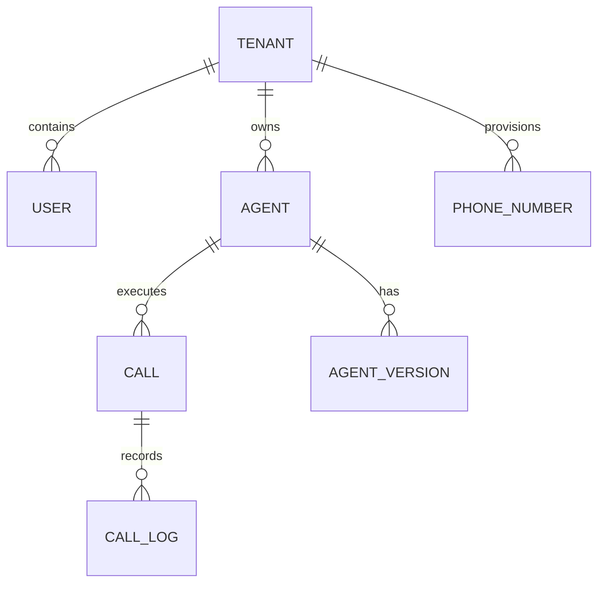

# DOMAIN MODEL

## 1. Core Entities
Our no-code Voice AI platform maintains a highly decoupled structural relationships optimized for performance and horizontal scale.

### Tenant
- `id` (UUID, Primary Key)
- `name` (String)
- `branding` (JSON: custom colors, logos, theme variables)
- `created_at` (Timestamp)

### User
- `id` (UUID, Primary Key)
- `email` (String, Unique)
- `role` (Enum: super_admin, tenant_admin, manager, recruiter, viewer)
- `tenant_id` (UUID, Foreign Key)
- `created_at` (Timestamp)

### Agent
- `id` (UUID, Primary Key)
- `name` (String)
- `description` (Text)
- `tenant_id` (UUID, Foreign Key)
- `status` (Enum: active, inactive, draft)
- `voice_config` (JSON)
- `llm_config` (JSON)
- `asr_config` (JSON)
- `tts_config` (JSON)
- `workflow_graph` (JSON: nodes, edges)
- `created_at` (Timestamp)
- `updated_at` (Timestamp)

### Phone Number
- `id` (UUID, Primary Key)
- `number` (String, Unique)
- `provider` (Enum: twilio, plivo, exotel)
- `tenant_id` (UUID, Foreign Key)
- `agent_id` (UUID, Foreign Key, Optional)
- `status` (Enum: active, released)
- `created_at` (Timestamp)
